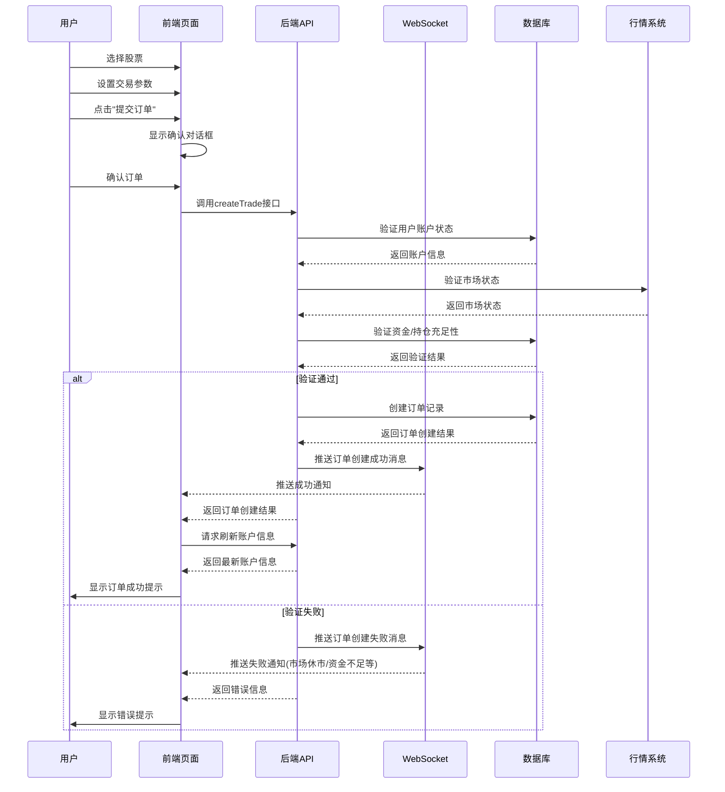

# 订单创建设计文档

## 1. 概述

本文档详细描述了股票交易系统中订单创建的完整流程，包括前端用户交互、API调用、后端处理以及数据流转过程。订单创建是交易系统的核心功能，涉及用户选择股票、设置交易参数、确认订单以及系统处理等多个环节。

## 2. 订单创建流程图



## 3. 前端实现流程

### 3.1 状态管理

在Transaction.vue组件中，使用Vue的响应式引用管理订单相关状态：

```javascript
// 交易相关状态
const orderType = ref('buy'); // 买入/卖出
const orderMode = ref('market'); // 市价/限价
const quantity = ref(10); // 数量
const limitPrice = ref(92.76); // 限价
const orderValidity = ref('当日有效'); // 订单有效期

// 对话框相关状态
const showDialog = ref(false);
const dialogMessage = ref('');
const dialogTitle = ref('');
```

### 3.2 订单提交流程

1. **提交订单按钮点击事件**：
   - 当用户点击"提交订单"按钮时，触发submitOrder函数
   - 函数显示确认对话框，展示订单信息供用户确认

2. **确认订单处理**：
   - 用户确认后，触发confirmOrder函数
   - 构造订单数据对象
   - 调用createTrade API接口提交订单
   - 处理成功/失败响应
   - 重新加载账户信息以获取最新状态

### 3.3 关键代码实现

```javascript
// 提交订单处理
const submitOrder = () => {
  // 显示确认对话框
  showDialog.value = true;
  dialogTitle.value = '确认订单';
  dialogMessage.value = `确定要${orderType.value === 'buy' ? '买入' : '卖出'} ${quantity.value} 股 ${selectedStock.value.name} 吗？`;
};

// 确认订单
const confirmOrder = async () => {
  try {
    // 调用order.js中的createTrade接口
    // 按照最新的后端TradeRequest类的结构准备数据，包含正确的默认值
    const orderData = {
      accountId: accountId.value, // 使用从账户信息中获取的交易账户ID
      securityId: selectedStock.value ? Number(selectedStock.value.code) : 0, // 证券ID，转换为数字类型以匹配后端Long类型
      orderType: orderMode.value === 'limit' ? 1 : orderMode.value === 'market' ? 2 : 1, // 订单类型: 1-限价单(默认), 2-市价单, 3-条件单
      direction: orderType.value === 'buy' ? 1 : 2, // 买卖方向: 1-买入, 2-卖出
      // 价格和数量设置默认值0，当有实际值时使用实际值
      price: limitPrice.value ? parseFloat(limitPrice.value) : 0, // 委托价格，默认值0
      quantity: quantity.value ? parseFloat(quantity.value) : 0, // 委托数量，默认值0
      // 订单过期时间设置为当前时间加一天，与Java类默认值保持一致
      expireTime: new Date(Date.now() + 24 * 60 * 60 * 1000), 
      conditionType: null, // 条件单类型（非条件单时为null）
      // 条件值设置默认值0，与Java类默认值保持一致
      conditionValue: 0, // 条件值，默认值0
      // 备注信息设置为空字符串作为默认值，当有实际值时使用实际值
      remark: selectedStock.value ? `交易${orderType.value === 'buy' ? '买入' : '卖出'} ${selectedStock.value.name}` : '' // 备注信息，默认值空字符串
    };
    
    const result = await createTrade(orderData);
    console.log('订单提交结果:', result);
    
    // 关闭对话框
    showDialog.value = false;
    
    // 显示成功提示
    alert('订单提交成功！');
    
    // 重新加载账户信息以获取最新的可用资金
    await loadAccountInfo();
    
  } catch (error) {
    console.error('下单失败:', error);
    // 关闭对话框
    showDialog.value = false;
    
    // 错误提示
    // 注意：市场状态和资金情况会由后端通过websocket返回并显示
  }
};
```

## 4. API接口设计

### 4.1 createTrade接口

**功能**: 创建交易订单

**请求参数**:
| 参数名 | 类型 | 默认值 | 说明 |
| :--- | :--- | :--- | :--- |
| accountId | Long | 无 | 资金账户ID，数据库字段类型: BIGINT UNSIGNED |
| securityId | Long | 0 | 证券ID，数据库字段类型: BIGINT UNSIGNED |
| orderType | Integer | 1 | 订单类型: 1-限价单, 2-市价单, 3-条件单，数据库字段类型: TINYINT |
| direction | Integer | 无 | 买卖方向: 1-买入, 2-卖出，数据库字段类型: TINYINT |
| price | Number | 0 | 委托价格(市价单可为0)，数据库字段类型: DECIMAL(18,6) |
| quantity | Number | 0 | 委托数量，数据库字段类型: DECIMAL(18,6) |
| expireTime | Date | 当前时间+1天 | 订单过期时间，数据库字段类型: DATETIME(3) |
| conditionType | Integer | null | 条件单类型: 1-价格条件, 2-时间条件，数据库字段类型: TINYINT |
| conditionValue | Number | 0 | 条件值，数据库字段类型: DECIMAL(18,6) |
| remark | String | "" | 备注信息，数据库字段类型: VARCHAR(500) |

**后端数据结构** (Java):
```java
public class TradeRequest implements Serializable {
    private static final long serialVersionUID = 1L;

    /**
     * 资金账户ID
     * 数据库字段类型: BIGINT UNSIGNED
     */
    private Long accountId;

    /**
     * 证券ID
     * 数据库字段类型: BIGINT UNSIGNED
     */
    private Long securityId;

    /**
     * 订单类型: 1-限价单, 2-市价单, 3-条件单
     * 数据库字段类型: TINYINT
     */
    private Integer orderType = 1; // 默认限价单

    /**
     * 买卖方向: 1-买入, 2-卖出
     * 数据库字段类型: TINYINT
     */
    private Integer direction;

    /**
     * 委托价格(市价单可为0)
     * 数据库字段类型: DECIMAL(18,6)
     */
    private BigDecimal price = BigDecimal.ZERO; // 默认值0

    /**
     * 委托数量
     * 数据库字段类型: DECIMAL(18,6)
     */
    private BigDecimal quantity = BigDecimal.ZERO; // 默认值0

    /**
     * 订单过期时间
     * 数据库字段类型: DATETIME(3)
     */
    private Date expireTime = new Date(System.currentTimeMillis() + 24 * 60 * 60 * 1000); // 默认过期时间：当前时间加一天

    /**
     * 条件单类型: 1-价格条件, 2-时间条件（条件单时使用）
     * 数据库字段类型: TINYINT
     */
    private Integer conditionType; // 非条件单时为null

    /**
     * 条件值（条件单时使用）
     * 数据库字段类型: DECIMAL(18,6)
     */
    private BigDecimal conditionValue = BigDecimal.ZERO; // 默认值0

    /**
     * 备注信息
     * 数据库字段类型: VARCHAR(500)
     */
    private String remark = ""; // 默认值空字符串
}

**API实现**:
```javascript
/**
 * 创建交易订单
 * @param {Object} orderData - 订单数据
 * @param {number} orderData.accountId - 资金账户ID
 * @param {number} orderData.securityId - 证券ID
 * @param {number} orderData.orderType - 订单类型: 1-限价单, 2-市价单, 3-条件单
 * @param {number} orderData.direction - 买卖方向: 1-买入, 2-卖出
 * @param {number} orderData.price - 委托价格(市价单可为0)
 * @param {number} orderData.quantity - 委托数量
 * @param {Date} orderData.expireTime - 订单过期时间
 * @param {number} orderData.conditionType - 条件单类型（非条件单时为null）
 * @param {number} orderData.conditionValue - 条件值（条件单时使用）
 * @param {string} orderData.remark - 备注信息
 * @returns {Promise} - 返回订单创建结果
 */
export function createTrade(orderData) {
  return request({
    url: '/api/trade/create',
    headers: {
      isToken: true
    },
    method: 'post',
    data: orderData
  })
}
```

### 4.2 相关辅助接口

- **获取可用资金**: `getAvailableFunds()` - 用于显示用户当前可用于交易的资金
- **获取总资产**: `getTotalAssets()` - 用于显示用户总资产信息
- **获取股票行情**: `getStockCurrentQuote(data)` - 获取股票实时价格和相关信息

## 5. 数据验证和错误处理

### 5.1 验证机制

根据系统设计，订单创建的验证主要在后端进行：

1. **市场状态验证**: 检查目标市场是否处于交易时段
2. **资金充足性验证**: 买入时检查用户资金是否足够
3. **持仓充足性验证**: 卖出时检查用户持股是否足够
4. **账户状态验证**: 检查用户账户是否正常（未冻结等）

### 5.2 错误通知机制

- **WebSocket推送**: 市场状态和资金情况由后端通过WebSocket实时推送
- **API返回错误**: 创建订单时的业务错误由API返回
- **前端提示**: 根据错误类型显示相应的用户提示

## 6. 订单创建后的处理

1. **关闭确认对话框**
2. **显示操作结果提示**
3. **重新加载账户信息**: 确保用户看到最新的资金和持仓状态
4. **更新交易历史**: 如有必要，更新交易历史记录

## 7. 安全考虑

1. **用户认证**: 所有交易API都需要JWT token验证（通过isToken: true设置）
2. **数据加密**: 交易数据在传输过程中应使用HTTPS加密
3. **幂等性设计**: 防止重复下单
4. **权限控制**: 确保用户只能操作自己的账户

## 8. 性能优化

1. **异步处理**: 使用async/await处理异步API调用
2. **缓存机制**: 合理缓存股票行情数据减少重复请求
3. **WebSocket实时更新**: 使用WebSocket减少轮询请求

## 9. 相关文件和组件

- **前端组件**: `src/views/client/Transaction.vue` - 交易主页面
- **API接口**: `src/api/order.js` - 包含所有订单相关API
- **WebSocket服务**: `src/plugins/websocket.js` - 处理实时消息推送

## 10. 未来改进方向

1. **增加更多订单类型**: 市价单、限价单、止损单等
2. **完善错误提示**: 提供更具体的错误信息和解决方案
3. **增加交易确认流程**: 大额交易时的额外验证
4. **优化用户体验**: 更直观的交易表单和结果展示
5. **增加订单预览**: 交易前预览订单详情和费用